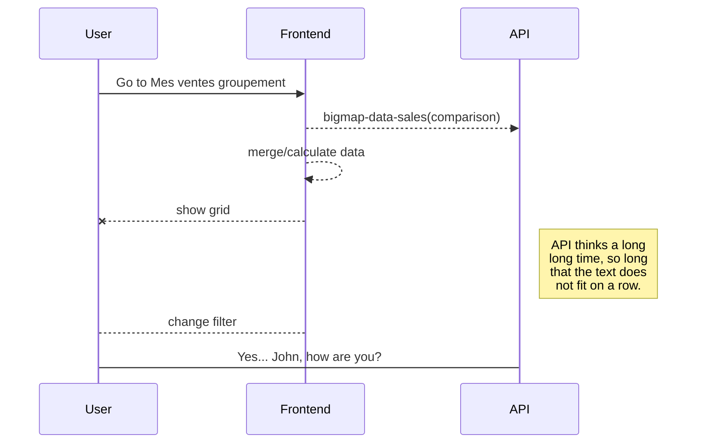
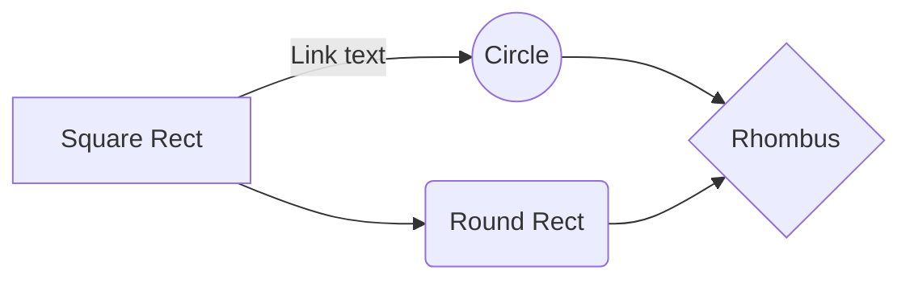

# JavaScript Documentation Sample

###  JsDoc
Check [JsDoc](https://jsdoc.app/) for more info
 1. Open a terminal
 2. Run `npx jsdoc .\src\ -c .\jsdoc.json`

### APIDoc
Check [APIDoc](https://apidocjs.com/) for more info
 1. Open a terminal
 2. Run `npx apidoc -i .\src\ -o .\apidoc\ -c .\apidoc.json`

### UML diagrams
Note: check imgs directory for samples  
You can render UML diagrams using [Mermaid](https://mermaidjs.github.io/). For example, this will produce a sequence diagram:

a flow chart:
**Note:** check imgs directory for samples  
We can use this diagram to describe Frontend scenarios 
